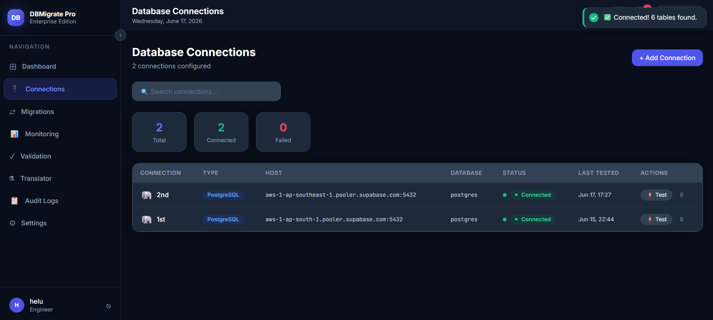
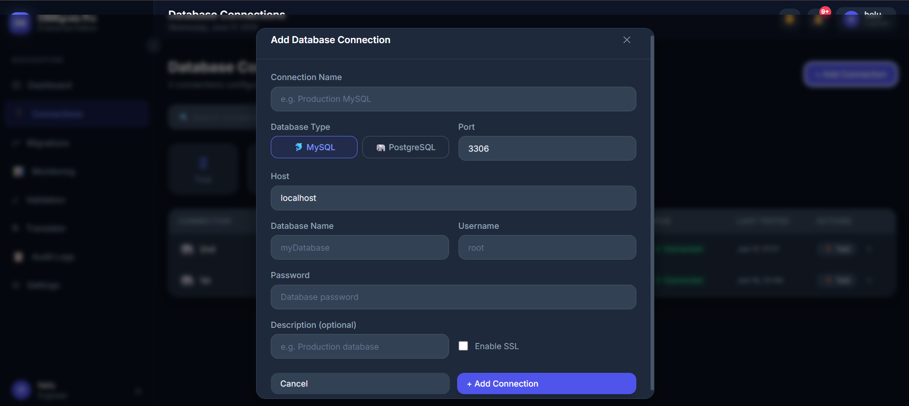
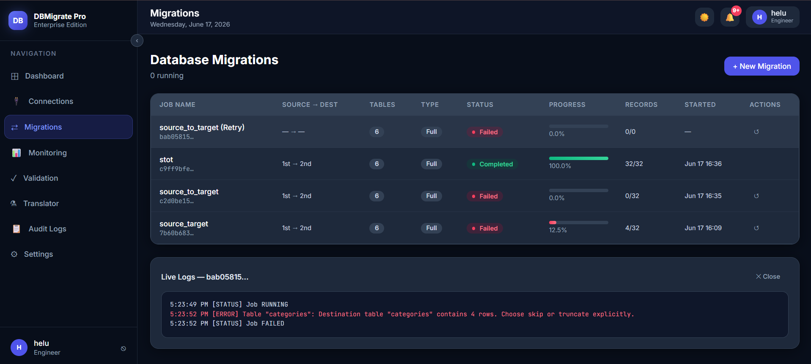
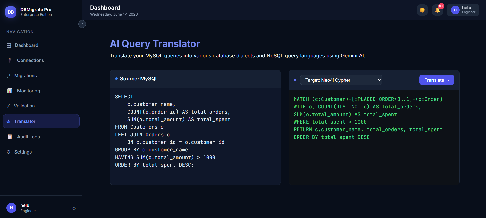
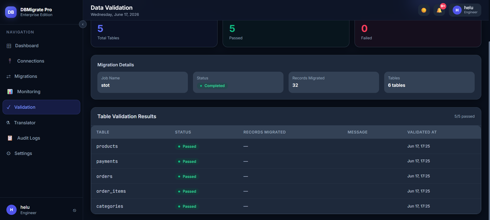

<div align="center">
  
  
  
  
  
  
  <br />
  
  <h1>🚀 DBMigrate Pro</h1>
  <h3>Enterprise Database Migration & Query Translation Platform</h3>
</div>

<br />

---

## 📖 Project Description

**DBMigrate Pro** is an enterprise-grade full-stack platform engineered to seamlessly orchestrate database migrations across different systems, combined with real-time monitoring, data validation, and an AI-powered query translation layer. 

Designed for scalability and accuracy, the system allows database administrators and developers to safely migrate schema and records from MySQL to PostgreSQL (and vice versa) without downtime. The built-in **AI Query Translator** leverages state-of-the-art LLMs (via Groq/Llama models) to dynamically convert SQL queries into highly divergent NoSQL and graph syntax, including MongoDB MQL, Neo4j Cypher, and Elasticsearch Query DSL.

This platform bridges the gap between relational integrity and modern NoSQL flexibility, featuring role-based access, comprehensive audit logging, and detailed validation pipelines.

---

## ✨ Key Features

- **🌐 Database Connection Management**: Add, securely test, and manage SSL-supported connections to multiple databases (MySQL, PostgreSQL, Supabase).
- **🔄 Database Migration Engine**: End-to-end table discovery, schema translation, and asynchronous batch migration with live progress monitoring and retry mechanisms.
- **🤖 AI Query Translator**: LLM-powered engine translating MySQL into PostgreSQL, MongoDB, Neo4j, Oracle, MS SQL, Elasticsearch, and Firestore.
- **🛡️ Data Validation Module**: Automated comparison of source and destination records post-migration to guarantee 100% data integrity.
- **📊 Real-time Monitoring Dashboard**: Interactive visualizations of connection statuses, migration success metrics, and aggregate statistics.
- **📋 Audit Logging System**: Granular tracking of user activity, migration executions, and connection modifications with CSV export capability.

---

## 🏗️ Architecture Diagram

```ascii
                      +-------------------+
                      |   Frontend (React)|
                      | - Dashboards      |
                      | - Translators     |
                      | - Validation UI   |
                      +---------+---------+
                                |
                          [REST API]
                                |
                      +---------v---------+
                      | Backend (Node.js) |
                      | - Express Server  |
                      | - JWT Auth        |
                      +----+---------+----+
                           |         |
            +--------------+         +--------------+
            |                                       |
    +-------v-------+                       +-------v-------+
    | DB Migration  |                       | AI Translator |
    | Engine (Batch)|                       | (Groq API)    |
    +-------+-------+                       +-------+-------+
            |                                       |
    +-------v-------+                       +-------v-------+
    | Source DBs    |                       | LLM Models    |
    | (MySQL, PG)   |                       | (Llama 3)     |
    +-------+-------+                       +---------------+
            |
    +-------v-------+
    | Dest DBs      |
    | (PostgreSQL)  |
    +---------------+
```

---

## 🛠️ Technology Stack

| Category | Technologies |
|---|---|
| **Frontend** | React, TypeScript, Vite, Tailwind CSS, ShadCN UI, Lucide Icons, React Router, Framer Motion |
| **Backend** | Node.js, Express.js, JavaScript/TypeScript, JWT, Socket.io |
| **Database Systems** | PostgreSQL, MySQL, Supabase (Cloud PostgreSQL) |
| **AI Layer** | Groq API SDK, Llama-3.3-70b-versatile, Prompt Engineering |

---

## ⚙️ System Workflows

### 🔄 Database Migration Flow
1. **Connection**: User registers and tests Source & Destination database credentials.
2. **Discovery**: System retrieves schemas, keys, constraints, and total record counts.
3. **Execution**: Tables are created automatically on the destination. Data is batched and streamed.
4. **Relationship Sync**: Foreign Keys and generated sequence constraints are deferred and synced in Phase 3.
5. **Validation**: Target row counts and schemas are automatically compared against the source.

### 🤖 AI Translation Flow
1. **Input**: User selects Source Language (e.g., MySQL) and Target Language (e.g., MongoDB MQL).
2. **Prompt Injection**: The query and dialects are injected into a highly specific system prompt.
3. **LLM Processing**: Groq's high-speed inference processes the translation via `llama-3.3-70b-versatile`.
4. **Sanitization**: The response is parsed, stripped of markdown artifacts, and displayed in the UI.

---

## 📂 Folder Structure

```text
DBMigrate Pro/
├── backend/
│   ├── src/
│   │   ├── controllers/      # Route handlers
│   │   ├── middleware/       # Auth & error handling
│   │   ├── models/           # DB schema models
│   │   ├── routes/           # Express API endpoints
│   │   ├── services/         # DB Adapter, AI Translator, Migration engine
│   │   └── utils/            # Logger, encryption utilities
│   ├── .env.example          # Environment vars example
│   └── package.json
├── frontend/
│   ├── src/
│   │   ├── api/              # API wrapper services
│   │   ├── components/       # Reusable UI components
│   │   ├── context/          # React Context (Auth)
│   │   ├── pages/            # Application views (Dashboard, Migration, Translator)
│   │   └── App.jsx           # Main routing
│   ├── vite.config.js
│   └── package.json
└── Screenshots/              # UI Demonstration images
```

---

## 🚀 Installation Guide

### Prerequisites
- **Node.js** (v18+)
- **MySQL / PostgreSQL** installed locally or hosted credentials.
- **Groq API Key** (for Query Translator).

### 1. Clone the repository
```bash
git clone https://github.com/yourusername/dbmigrate-pro.git
cd dbmigrate-pro
```

### 2. Setup Backend
```bash
cd backend
npm install
cp .env.example .env
# Edit .env with your local DB credentials and Groq API key
npm run dev
```

### 3. Setup Frontend
```bash
cd ../frontend
npm install
npm run dev
```

---

## 🔐 Environment Variables (.env)

The `backend/.env` requires the following critical variables:

```env
# System Database (MySQL/PG - stores app data)
SYSTEM_DB_HOST=localhost
SYSTEM_DB_PORT=3306
SYSTEM_DB_NAME=dbmigrate_system
SYSTEM_DB_USER=root
SYSTEM_DB_PASSWORD=yourpassword

# Security
JWT_SECRET=super_secret_jwt_string
ENCRYPTION_KEY=32_character_aes_encryption_key_

# Groq AI Integration
GROQ_API_KEY=gsk_your_groq_api_key_here
```

---

<<<<<<< HEAD
=======
## 📡 API Endpoints

| Method | Endpoint | Description |
|---|---|---|
| `POST` | `/api/auth/login` | Authenticate user & receive JWT |
| `GET` | `/api/connections` | Retrieve all registered DB connections |
| `POST` | `/api/migrations/run` | Initiate asynchronous data migration |
| `GET` | `/api/monitoring/stats` | Fetch aggregate server and DB statistics |
| `POST` | `/api/query/translate` | Translate query string via Groq AI |
| `GET` | `/api/logs` | Fetch system audit logs |
>>>>>>> 7160fd6 (Upload project to GitHub)

---

## 📸 Application Screenshots

### 1. Dashboard Overview


### 2. Database Connections


### 3. Migration Engine


### 4. AI Query Translator


### 5. Data Validation Dashboard


*(Images are stored in the `/Screenshots` directory)*

---

## 🚀 Future Enhancements

- **Bi-Directional Schema Syncing**: Automatic polling to detect schema drift between linked databases.
- **Scheduling Engine**: Cron-based scheduled migrations for recurring ETL pipelines.
- **Additional Connectors**: Expand native support for MongoDB and Redis as migration targets.

---

## 🛡️ Security Features
- **AES-256 Encryption**: All database passwords and sensitive credentials are encrypted at rest.
- **JWT Authentication**: Role-based access control protecting API routes and actions.
- **Input Sanitization**: Protection against SQL Injection during connection validations.
- **Rate Limiting**: Integrated Express rate-limiting to prevent API abuse.

---

## ⚡ Performance Features
- **Asynchronous Batch Processing**: Migrations are chunked and streamed (default 1000 rows/batch) to prevent memory overflow on large datasets.
- **Socket.io Integration**: Real-time progress updates without heavy HTTP polling.
- **Deferred Constraints**: Foreign keys are applied post-migration to bypass dependency deadlock.

---

## 🎓 Learning Outcomes
- Developed comprehensive understanding of **ETL (Extract, Transform, Load)** pipelines and asynchronous data streaming.
- Mastered bridging modern **LLM APIs (Groq/Llama)** with traditional full-stack web applications.
- Implemented robust **security architectures**, focusing on encryption at rest and role-based access.

---

## 📄 Resume Project Description

**DBMigrate Pro | Full-Stack Database Migration & AI Query Translation Engine**
* Architected an enterprise ETL platform utilizing React, Node.js, and Express to orchestrate secure, zero-downtime database migrations between MySQL and PostgreSQL.
* Engineered a batched, asynchronous migration pipeline capable of streaming large datasets alongside real-time Socket.io progress tracking and post-migration schema validation.
* Integrated the Groq SDK and Llama-3 LLM to develop a dynamic, low-latency AI Query Translator bridging relational SQL syntaxes with NoSQL graph and document querying structures.

---

## 🏆 Project Highlights
- Fully automated **Phase 3 Foreign Key resolution** algorithm preventing complex relational deadlocks.
- High-performance API integration fetching translations via **Llama-3.3-70b-versatile**.
- Extensible, role-based, production-ready architecture designed for horizontal scalability.

---

## 📜 License

This project is licensed under the MIT License. See the [LICENSE](LICENSE) file for more details.
